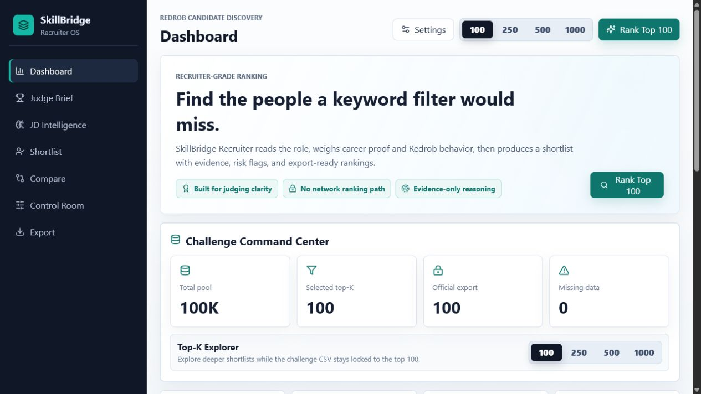
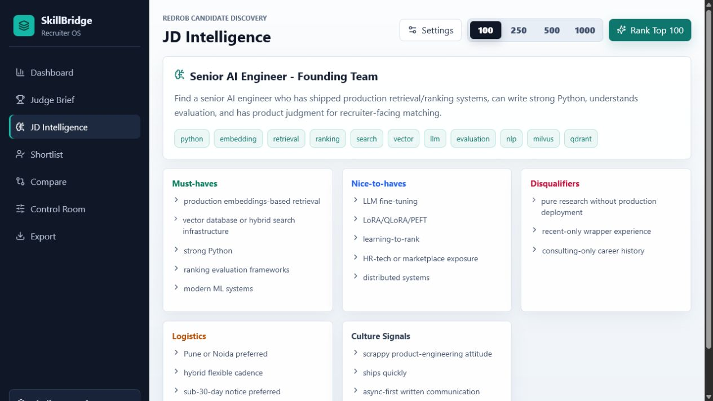
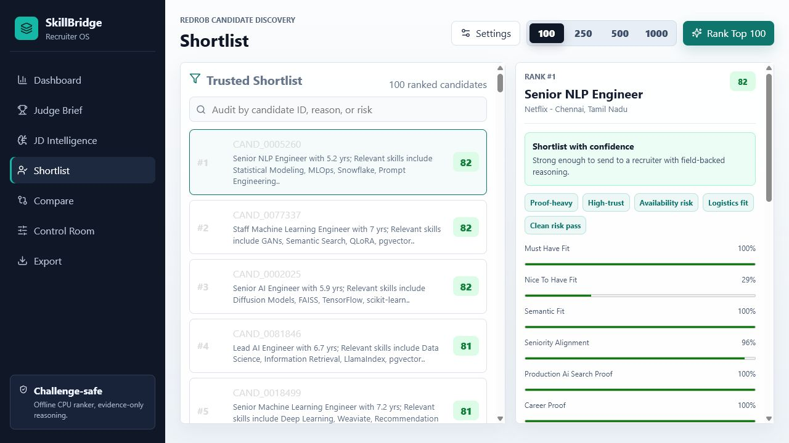
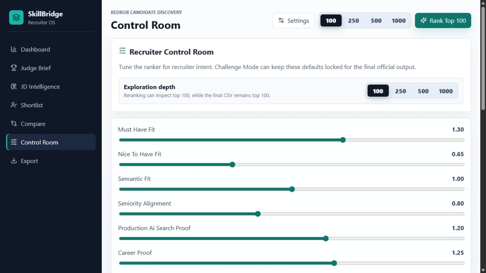
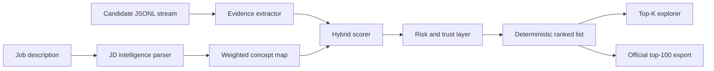

<div align="center">

# SkillBridge Recruiter

### Recruiter-grade candidate discovery for the Redrob Data & AI Challenge

SkillBridge ranks candidates the way a strong recruiter would: by understanding role intent, career proof, behavioral reliability, logistics fit, and risk signals instead of only matching keywords.

<p>
  <a href="https://anuranjanjain.github.io/India.runs/"></a>
  <a href="https://raw.githubusercontent.com/AnuranjanJain/India.runs/main/frontend/public/demo/SkillBridge-Recruiter-Website-Demo-1min.mp4"></a>
  <a href="#offline-challenge-command"></a>
</p>

<p>
  
  
  
  
  
</p>

</div>

---

## Demo

| Asset | Link |
| --- | --- |
| Live product | [Open SkillBridge Recruiter](https://anuranjanjain.github.io/India.runs/) |
| 1-minute narrated walkthrough | [Watch MP4](https://raw.githubusercontent.com/AnuranjanJain/India.runs/main/frontend/public/demo/SkillBridge-Recruiter-Website-Demo-1min.mp4) |
| Subtitle file | [Download SRT](https://raw.githubusercontent.com/AnuranjanJain/India.runs/main/frontend/public/demo/SkillBridge-Recruiter-Website-Demo-1min.srt) |

<div align="center">
  <a href="https://raw.githubusercontent.com/AnuranjanJain/India.runs/main/frontend/public/demo/SkillBridge-Recruiter-Website-Demo-1min.mp4">
    
  </a>
</div>

---

## The Product In One View

SkillBridge Recruiter is both a polished recruiter webapp and a reproducible ranking engine. Judges can inspect the product experience, while the official challenge path remains deterministic and offline.

| What recruiters see | What the ranker does |
| --- | --- |
| Challenge Command Center | Shows total candidate pool, selected top-K, official export status, trust signals, and risk counts. |
| JD Intelligence | Converts the job description into must-haves, nice-to-haves, disqualifiers, logistics, and culture signals. |
| Trusted Shortlist | Ranks candidates with score bands, evidence snippets, weak dimensions, and risk flags. |
| Candidate Evidence | Grounds every explanation in actual candidate fields and Redrob signals. |
| Compare View | Lets recruiters inspect 2-5 finalists side by side. |
| Control Room | Simulates ranking shifts as recruiter priorities change. |
| Export Guardrails | Keeps the challenge output locked to the official top-100 format. |

---

## Screenshots

<table>
  <tr>
    <td width="50%">
      <strong>JD Intelligence</strong><br>
      
    </td>
    <td width="50%">
      <strong>Trusted Shortlist</strong><br>
      
    </td>
  </tr>
  <tr>
    <td width="50%">
      <strong>Candidate Evidence</strong><br>
      
    </td>
    <td width="50%">
      <strong>Control Room</strong><br>
      
    </td>
  </tr>
</table>

---

## Why This Is More Than Keyword Search

| Signal | Why it matters |
| --- | --- |
| Semantic JD concepts | Finds adjacent evidence such as ranking systems, retrieval, vector search, model evaluation, and production ML even when exact keywords differ. |
| Career-history proof | Rewards skills that appear in real work history, not only in a skill list. |
| Anti-keyword-stuffing | Penalizes candidates who claim many relevant terms without matching evidence. |
| Behavioral reliability | Uses Redrob-style activity, responsiveness, availability, and notice-period signals to estimate recruiter trust. |
| Logistics fit | Accounts for location, work mode, salary range, and availability. |
| Evidence-only reasoning | Explanations are generated from candidate fields to avoid hallucinated fit. |

---

## Hybrid Ranking Method

SkillBridge uses a deterministic hybrid scorer rather than a hosted LLM dependency for the official path.



### Score Dimensions

| Dimension | Examples |
| --- | --- |
| Must-have fit | AI engineering, Python, ML systems, semantic search, ranking, LLM workflows. |
| Production proof | Real project history, MLOps, deployment, vector databases, search backends. |
| Evaluation depth | Ranking metrics, model validation, experiments, retrieval quality checks. |
| Seniority alignment | Title level, years of experience, scope, ownership signals. |
| Product/startup fit | Ambiguous problem solving, product orientation, cross-functional work. |
| Skill trust | Skills supported by history, assessments, proficiency, duration, and recency. |
| Behavioral reliability | Response behavior, activity recency, availability, notice period. |
| Logistics | Location, work mode, salary, and joining constraints. |
| Data quality | Completeness, verification, stale profile risk, suspicious stuffing. |

---

## Architecture

<div align="center">
  
</div>

### Challenge-Safe Design

- **Frontend**: React, TypeScript, Vite, dense SaaS-style recruiter dashboard.
- **Backend**: FastAPI with Pydantic schemas, ranking endpoints, explainability endpoints, and export validation.
- **Ranking engine**: deterministic Python scorer with streaming JSONL support.
- **Storage**: SQLite-ready structure for saved jobs, rank runs, score breakdowns, and exports.
- **Official mode**: CPU-only, offline, reproducible, no hosted LLM calls required.
- **Demo mode**: static GitHub Pages experience backed by public dataset chunks.

---

## Offline Challenge Command

Use the full dataset when available:

```powershell
python rank.py --candidates .\data\candidates.jsonl --job .\data\job_description.docx --out .\submission.csv --top-n 1000 --diagnostics
python .\data\validate_submission.py .\submission.csv
```

`--top-n` supports `100`, `250`, `500`, and `1000` for recruiter exploration. The official challenge export remains locked to the top 100.

The repo includes `data/demo_candidates.json` for fast local runs. The full local `data/candidates.jsonl` is intentionally ignored because it is large, while the hosted demo serves the 100,000-candidate pool through static chunks under `frontend/public/data/candidate_chunks/`.

---

## Run Locally

### 1. Install dependencies

```powershell
pip install -r requirements.txt
cd frontend
npm install
cd ..
```

### 2. Start the API

```powershell
$env:PYTHONPATH='backend'
python -m uvicorn skillbridge_recruiter.api:app --host 127.0.0.1 --port 8000
```

### 3. Start the webapp

```powershell
cd frontend
npm run dev -- --port 5173
```

Open `http://127.0.0.1:5173`.

---

## API Surface

| Endpoint | Purpose |
| --- | --- |
| `GET /api/health` | Health check |
| `GET /api/dataset/summary` | Dataset overview and candidate counts |
| `POST /api/jobs/analyze` | JD intelligence extraction |
| `POST /api/rank` | Run top-K ranking |
| `GET /api/rank-runs/{run_id}` | Fetch ranked candidates |
| `GET /api/rank-runs/{run_id}/diagnostics` | Score bands, weak dimensions, risk summaries |
| `GET /api/rank-runs/{run_id}/near-misses` | Candidates near the official cutoff |
| `GET /api/candidates/{candidate_id}/explain` | Evidence-grounded explanation |
| `POST /api/candidates/search` | Candidate lookup |
| `POST /api/candidates/audit` | Candidate audit by ID |
| `POST /api/compare` | Compare selected candidates |
| `GET /api/export/{run_id}.csv` | Official top-100 export |
| `GET /api/export/{run_id}/exploration.csv` | Exploration export |
| `POST /api/validate-submission` | Submission format validation |

---

## Verification

```powershell
python -m pytest
python rank.py --candidates data\demo_candidates.json --job data\job_description.docx --out data\demo_submission.csv --top-n 250 --diagnostics
python data\validate_submission.py data\demo_submission.csv
cd frontend
npm run build
```

Tested paths include:

- JD parsing for must-haves, nice-to-haves, disqualifiers, logistics, and culture.
- Scoring behavior for strong fit, keyword stuffing, weak production proof, stale activity, high notice period, and missing fields.
- API smoke tests for dataset summary, ranking, diagnostics, near misses, and export.
- Browser smoke tests for top `100`, `250`, `500`, and `1000` exploration.

---

## Repository Map

```text
backend/                     FastAPI app, schemas, services, and ranking APIs
frontend/                    React + TypeScript recruiter dashboard
frontend/public/data/        Demo dataset and hosted candidate chunks
frontend/public/demo/        Narrated 1-minute demo video and subtitles
data/                        Job description, validators, and demo candidates
rank.py                      Offline challenge ranking command
tests/                       Unit and integration tests
docs/assets/                 README screenshots and architecture visuals
```

---

## Submission Story

SkillBridge is designed to make the judging story obvious in the first minute:

1. It understands the job description as hiring intent.
2. It ranks candidates with semantic fit plus career evidence.
3. It exposes risks that keyword filters hide.
4. It lets recruiters inspect, compare, tune, and export.
5. It keeps the official output deterministic, offline, and reproducible.

Built for the Redrob Data & AI Challenge: Intelligent Candidate Discovery.
